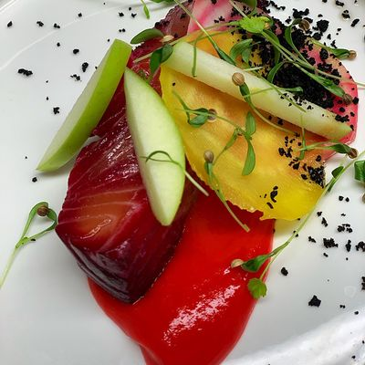
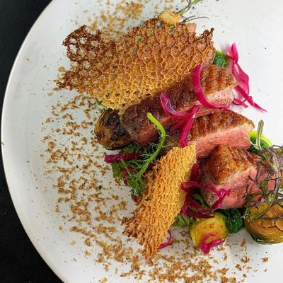
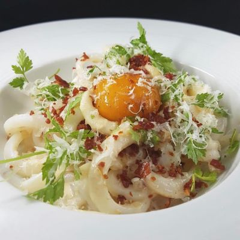
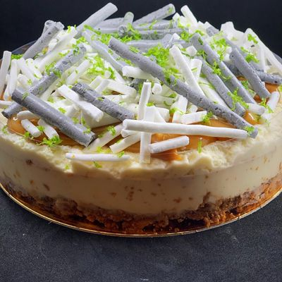

--- 
layout: default 
title: Galerie
script: gallery.js
---

    

        <h1 class="title-1">Galerie</h1>
    

    

        

            <a class="gallery-box" href="images/gallery/1-max.jpg" data-lightbox="gallery">
                
                 

                
            

            </a>                   
        
<!--end gallery col-->
        

            <a class="gallery-box" href="images/gallery/2-max.jpg" data-lightbox="gallery">
                
                 

                
            

            </a>                   
        
<!--end gallery col-->
        

            <a class="gallery-box" href="images/gallery/3-max.jpg" data-lightbox="gallery">
                
                 

                
            

            </a>                   
        
<!--end gallery col-->
        

            <a class="gallery-box" href="images/gallery/4-max.jpg" data-lightbox="gallery">
                
                 

                
            

            </a>                   
        
<!--end gallery col-->
    

     

        

            <a class="gallery-box" href="images/gallery/5-max.jpg" data-lightbox="gallery">
                
                 

                
            

            </a>                   
        
<!--end gallery col-->
        

            <a class="gallery-box" href="images/gallery/6-max.jpg" data-lightbox="gallery">
                
                 

                
            

            </a>                   
        
<!--end gallery col-->
        

            <a class="gallery-box" href="images/gallery/7-max.jpg" data-lightbox="gallery">
                
                 

                
            

            </a>                   
        
<!--end gallery col-->
        

            <a class="gallery-box" href="images/gallery/8-max.jpg" data-lightbox="gallery">
                
                 

                
            

            </a>                   
        
<!--end gallery col-->
    

