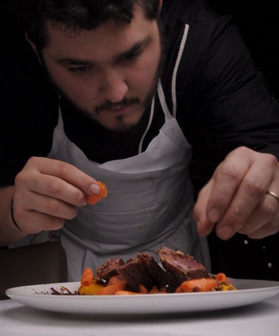
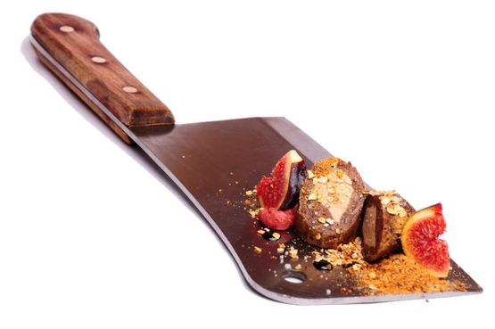
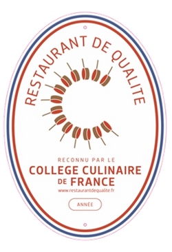
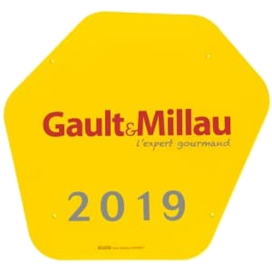
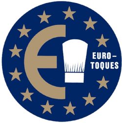
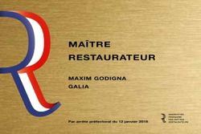
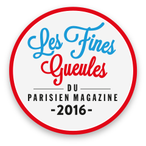

    

        <h1 class="title-1">GALIA par Maxim Godigna</h1>
    

    

        

            

                <h1 class="title-1">Découvrez le restaurant</h1>
                <h5 class="subtitle">Maxim Godigna</h5>
                

                

                    Diplômé de la haute Ecole de cuisine Gregoire Ferrandi et issu d'établissements étoilés de renommé mondiale comme le Park Hyatt Place Vendôme, ou le restaurant Le paris de l'hôtel le Lutetia,
                    Maxim Godigna a crée son restaurant Galia en 2015.
                

                <blockquote>
                    La cuisine du chef est une fusion franco-sudaméricaine avec une carte qui change toutes les semaines en fonction de son inspiration. Tous les plats sont élaborés sur place à partir de produits bruts de qualité.
                </blockquote>
                
              

              <h1 class="title-1">
                En savoir plus...
              </h1>
              

              <h1 class="title-1" style="text-transform: unset"><a href="https://www.maximgodigna.com">maximgodigna.com</a></h1>
            

            

                
            

        

    

    

        

            

                

                    " L'ambition n'est jamais trop grande quand on allie savoir-faire et passion "
                

                Maxim Godigna
            

        

    

    

        <h1 class="title-1">La Carte</h1>
        

    

    

        

            <ul class="list-unstyled">
                <li class="menu-box clearfix margin-b-20">
                    

                        <h4>Menu à la carte36€</h4>
                        
Entrée, Plat, Dessert (les midis et soirs du mardi au dimanche)

                    

                </li>
                <li class="menu-box clearfix margin-b-20">
                    

                        <h4>Menu du jour17€</h4>
                        
Entrée, Plat ou Plat, Dessert (les midis du mardi au vendredi)

                    

                </li>
                <li class="menu-box clearfix margin-b-20">
                    

                        <h4>Menu du jour21,50€</h4>
                        
Entrée, Plat, Dessert (les midis du mardi au vendredi)

                    

                </li>
                <li class="menu-box clearfix margin-b-20">
                    

                        <h4>Menu Dégustation55€</h4>
                        
5 services (les midis et soirs du mardi au dimanche)

                    

                </li>
                <li class="menu-box clearfix margin-b-20">
                    

                        <h4>Menu Dégustation65€</h4>
                        
6 services (les midis et soirs du mardi au dimanche)

                    

                </li>
            </ul>
        

        

            

                
            

        

    

    

        

            

                <h1 class="text-uppercase">Distinctions</h1>
                

                    En 2016, Galia a été classé 16ème meilleur restaurant à moins de 50euros par les fines gueules du Parisien Magazine puis il a été nominé avec 3 autres restaurants Parisiens au prix de la meilleure installation du guide culinaire Lebey.
                

                

                    Engagé à respecter les produits de qualité et participant activement à la promotion et la transmission du patrimoine culinaire français, le chef Godigna a reçu l'appellation de restaurant de qualité du Collège Culinaire de France et attribuée par le plus grand rassemblement de chefs.
                

                

                    En 2017 le chef devient membre actif de l'association Euro - Toques France et s'engage à défendre les produits sains de qualité. Euro-toques France est la seule association lobbyiste de chefs cuisiniers reconnue officiellement par la commision europénne
                    et elle bénéficie d'une présence permanente à Bruxelles au coeur du système décisionnel européen.
                

                

                    En 2018, il reçoit une toque du guide Gastronomique français Gault et Millau et le titre de Maitre Restaurateur lui est également attribué. Ce titre est validé après les audits de contrôle qui valident ses connaissances en tant que chef cuisinier de métier.
                

            

        

        

            

                
            

            

                
            

            

                
            

        

        

            

                
            

            

                
            

        

    

